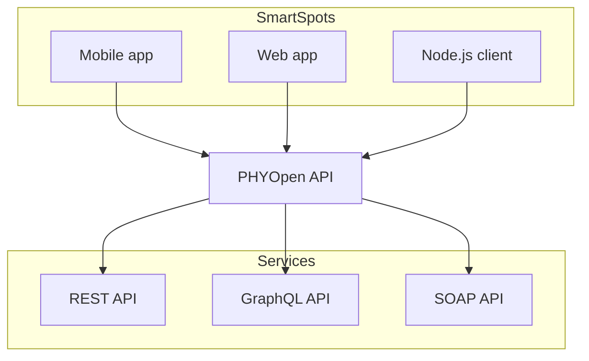

# ASTRALIS Constellation

The main network that interacts with the Physis ecosystem and OpenAPI is called the Constellation

```mermaid
graph TD;
subgraph AA [SmartSpots]
A[Mobile app];
B[Web app];
C[Node.js client];
end
subgraph BB [Services]
E[REST API];
F[GraphQL API];
G[SOAP API];
end
Z[PHYOpen API];
A --> Z;
B --> Z;
C --> Z;
Z --> E;
Z --> F;
Z --> G;
```

All equations go here**: $a=\sqrt{b^2 + c^2}$.
